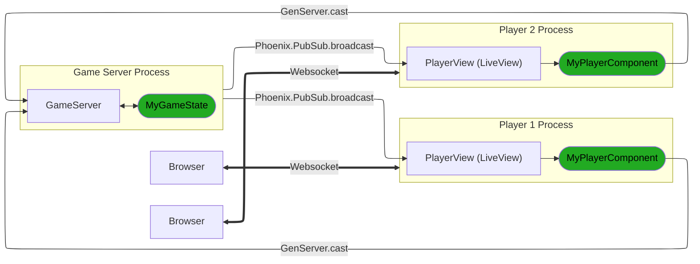
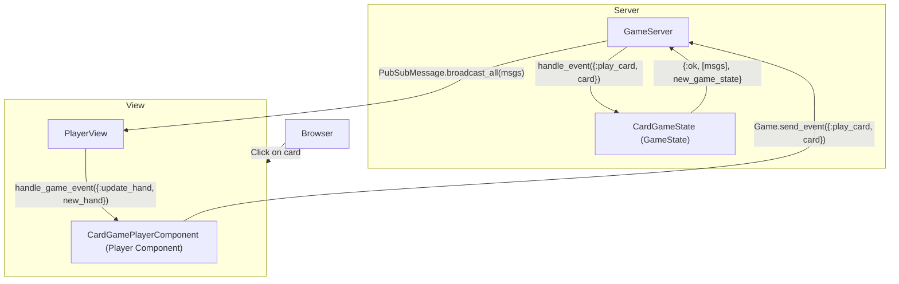

# Web Games Architecture

The Web Games framework consists of two main parts - the Server and the View.
The Server is the process that runs game logic and holds the game state. The
View is a process connected to each player that holds rendering logic and
player-specific state.

## Server vs View: Game State

Both the Server and View contain "state" information about the game, but they
are not exact copies of each other.

Consider a card game with 4 players where the goal is to play
all cards in your hand first.

Each player has a hand of cards, there is a face-up discard pile, and the remaining
cards would all be in the deck.

The Server would have information about where every card in the game is - the
deck, the discard (and what order they're in), as well as each players hand.

However, the View only needs the following information to render something
from a player's perspective:
* The list of cards in that players hand.
* The number of cards in every other players hands.
* The current face-up card in the discard.
* The number of cards left in the deck.

As such, the View would only contain that player-specific state, which is a
partial copy (or derivative) of what's in the Server state.

## Communication between Server and View

Communication between Server and View is done with a unidirectional flow. The
View `GenServer.cast()`s event calls to the Server in order to convey player
actions, and the Server communicates back via `Phoenix.PubSub` to convey
game state changes that require a view update.

Going back to the previous example, if a player wants to play a card from their
hand, a click event on their LiveComponent would call `Game.send_event()`
(which is a wrapper for `GenServer.cast()`) with the card they want to play.

The Server will handle all of the game logic (e.g. Checking if this is a legal
play, moving the card out of the players hand and into the discard pile, etc)
and will send messages to all the players via `Phoenix.PubSub`:

* To the player who just played a card, it will tell them to update their hand
  to remove the card they just played.
* To all other players, it will tell them to update that players hand to have
  fewer cards in it.
* To all players, it will tell them what the new current face-up card in the
  discard pile is.

Other messages could be sent here as well, such as a message to all players
if one player has won.

Each View is subscribed to multiple `PubSub` topics, such as one for all players,
and one for just them, allowing them to capture all information relevant to
their player.

A message API is included in the form of `GamePlatform.PubSubMessage` which
wraps messages sent to Views in a standardized format and broadcasts them to the
correct topics based on who they are `:to`.

## Modules

There are 4 key modules that make up a game in this framework:
* **GameServer**: The underlying GenServer running in the Server process.
* **GameState**: A behaviour intended to be implemented with game-specific logic.
  When creating your own game, your game logic will live in a module that
  implements GameState. Functions in this module are called by the GameServer.
* **PlayerView**: The LiveView being displayed to each player.
* **PlayerComponent**: An extension of the LiveComponent behaviour that allows for
  handling of incoming game events. This component is embedded into the LiveView
  displayed to each player. When creating your own game, your rendering and
  view logic will live in a module that implements PlayerComponent.

There are two axes we can view these modules from: Server vs View, and
Platform vs Behaviour (or Implemented).

* **GameServer**: Platform Server
* **GameState**: Implemented Server
* **PlayerView**: Platform View
* **PlayerComponent**: Implemented View

We've already talked about Server vs View, but they essentially represent the
"backend" and "frontend" of the game. The Server is running in it's own process,
while there is a View process for each player handling rendering.

Platform modules are those built into the "framework" of WebGames. These handle
things like player connection logic, automatic timeouts, player disconnections,
sending messages, etc. All of the boilerplate that runs "above" the actual
game logic.

Behaviour modules are modules passed to the Platform modules, and represent
specific games. These contain functions that link them to the Server or View,
hooking your game logic into them.

## Further reading
* [Server Documentation](Server.md)
* [View Documentation](View.md)